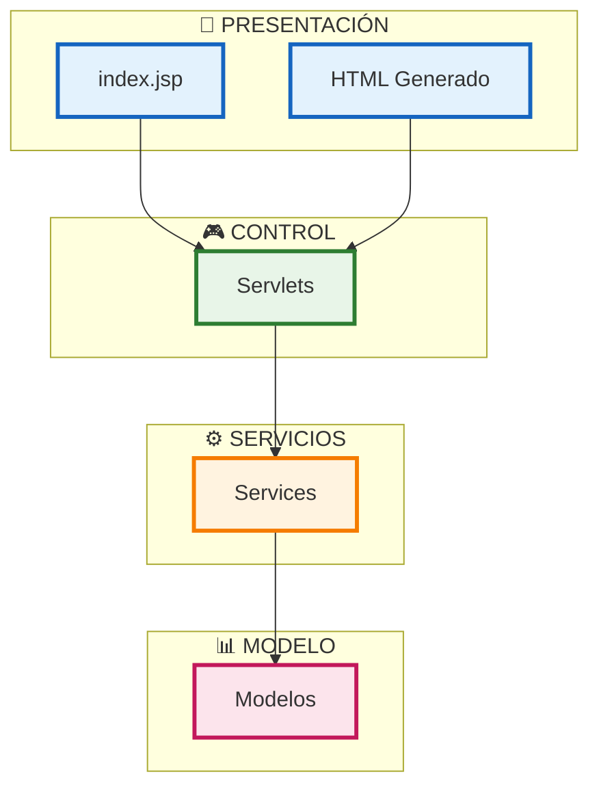

# 🏗️ Análisis de Arquitectura - Librería Digital

## 📋 Preguntas Clave de Arquitectura

### 1. 🧩 ¿Cuáles son los componentes funcionales de la aplicación y cómo se relacionan entre sí?

La aplicación **Librería Digital** es un sistema de gestión de librería que sigue una arquitectura **MVC (Model-View-Controller)** tradicional basada en **Servlets Java**. Los componentes principales son:

#### **🎯 Componentes Funcionales:**
- **🎨 Capa de Presentación (View)**: JSP y HTML generado dinámicamente
- **🎮 Capa de Control (Controller)**: Servlets que manejan las peticiones HTTP
- **📊 Capa de Modelo (Model)**: Clases de dominio y servicios de negocio
- **⚙️ Capa de Servicios**: Lógica de negocio y acceso a datos

#### **🔗 Relaciones entre componentes:**
```
🌐 Cliente HTTP → 🎮 Servlet (Controller) → ⚙️ Service (Business Logic) → 📊 Model (Data)
                                    ↓
                            🎨 JSP/HTML (View) ← 📄 Response
```

#### **🔄 Flujo de datos:**
1. **📥 Las peticiones HTTP** llegan a los Servlets configurados en `web.xml`
2. **🎮 Los Servlets** procesan la lógica de presentación y delegan la lógica de negocio a los Services
3. **⚙️ Los Services** interactúan con los modelos de datos
4. **📤 La respuesta** se genera como HTML dinámico desde los Servlets

---

### 2. 🚀 ¿Cómo es el despliegue de los componentes en el entorno productivo?

#### **🏗️ Arquitectura de Despliegue:**
- **📦 Tipo de aplicación**: Aplicación web Java EE (Jakarta EE)
- **📋 Empaquetado**: WAR (Web Application Archive)
- **🖥️ Servidor de aplicaciones**: Configurado para Jetty y Tomcat
- **🔌 Puerto**: 8080 (configurado en `pom.xml`)
- **🌐 Contexto**: `/libreria-digital`

#### **⚙️ Configuración de despliegue:**
```xml
<!-- 🚀 Configuración Jetty -->
<plugin>
    <groupId>org.eclipse.jetty</groupId>
    <artifactId>jetty-maven-plugin</artifactId>
    <version>9.4.51.v20230217</version>
    <configuration>
        <webAppSourceDirectory>src/main/webapp</webAppSourceDirectory>
        <contextPath>/</contextPath>
    </configuration>
</plugin>

<!-- 🐱 Configuración Tomcat -->
<plugin>
    <groupId>org.apache.tomcat.maven</groupId>
    <artifactId>tomcat7-maven-plugin</artifactId>
    <version>2.2</version>
    <configuration>
        <port>8080</port>
        <path>/libreria-digital</path>
        <uriEncoding>UTF-8</uriEncoding>
    </configuration>
</plugin>
```

---

### 3. 💾 ¿Cómo interactúan los componentes con las fuentes de datos?

#### **🗄️ Patrón de acceso a datos:**
- **💾 Almacenamiento en memoria**: Utiliza el patrón **Singleton** con `AlmacenamientoService`
- **⚠️ Sin persistencia**: Los datos se almacenan en listas en memoria (se pierden al reiniciar)
- **📋 Estructura de datos**: Utiliza `ArrayList` para cada entidad (clientes, productos, ventas, etc.)

#### **🔧 Servicio de almacenamiento:**
```java
public class AlmacenamientoService {
    private static AlmacenamientoService instance;
    private final List<Cliente> clientes;
    private final List<Producto> productos;
    private final List<Venta> ventas;
    private final List<Categoria> categorias;
    private final List<Descuento> descuentos;
}
```

#### **🚨 Limitaciones actuales:**
- ❌ No hay base de datos persistente
- ❌ No hay mecanismos de backup
- ❌ Los datos se reinician en cada despliegue
- ❌ No hay transacciones ni integridad referencial

---

### 4. 🎯 ¿Qué patrones y tácticas de arquitectura se están utilizando?

#### **🏛️ Patrones de Arquitectura identificados:**

1. **🎭 MVC (Model-View-Controller)**
   - **📊 Model**: Clases de dominio (`Cliente`, `Producto`, `Venta`, etc.)
   - **🎨 View**: JSP y HTML generado dinámicamente
   - **🎮 Controller**: Servlets que manejan las peticiones

2. **🔒 Singleton Pattern**
   - `AlmacenamientoService.getInstance()` para acceso global a datos

3. **⚙️ Service Layer Pattern**
   - `AlmacenamientoService` y `ReporteService` encapsulan la lógica de negocio

4. **🚪 Front Controller Pattern**
   - Cada Servlet actúa como front controller para su dominio específico

5. **📦 Data Transfer Object (DTO)**
   - Los modelos actúan como DTOs para transferir datos entre capas

#### **🛠️ Tácticas de arquitectura:**
- **🎯 Separación de responsabilidades**: Cada Servlet maneja una entidad específica
- **🔒 Encapsulación**: Los servicios ocultan la complejidad del acceso a datos
- **📏 Cohesión alta**: Cada componente tiene una responsabilidad bien definida

---

### 5. 🛠️ ¿Qué tecnologías y frameworks forman parte de la arquitectura?

#### **🔧 Stack tecnológico:**

**⚙️ Backend:**
- **☕ Java 11**: Lenguaje de programación principal
- **🌐 Jakarta EE 6.0**: API de Servlets y JSP
- **📦 Maven**: Gestión de dependencias y build
- **🖥️ Jetty/Tomcat**: Servidores de aplicaciones web

**🎨 Frontend:**
- **🌍 HTML5**: Estructura de páginas
- **🎨 CSS3**: Estilos (inline en los Servlets)
- **⚡ JavaScript**: Mínimo (solo funcionalidad básica del navegador)

#### **📚 Dependencias principales:**
```xml
<!-- 🌐 Servlet API -->
<dependency>
    <groupId>jakarta.servlet</groupId>
    <artifactId>jakarta.servlet-api</artifactId>
    <version>6.0.0</version>
</dependency>

<!-- 📄 JSP API -->
<dependency>
    <groupId>jakarta.servlet.jsp</groupId>
    <artifactId>jakarta.servlet.jsp-api</artifactId>
    <version>3.1.1</version>
</dependency>

<!-- 🏷️ JSTL -->
<dependency>
    <groupId>jakarta.servlet.jsp.jstl</groupId>
    <artifactId>jakarta.servlet.jsp.jstl-api</artifactId>
    <version>3.0.0</version>
</dependency>
```

---

### 6. 🏢 ¿Cuáles son los principales módulos o capas en la aplicación?
Arquitectura en capas:
#### **🏗️ **



---

### 7. 🔗 ¿Existen dependencias entre los servicios o microservicios?

#### **🏢 Arquitectura monolítica:**
- **❌ No es una arquitectura de microservicios**
- **📦 Aplicación monolítica** con todos los componentes en un solo WAR
- **🔗 Dependencias internas** entre servicios:
  - `AlmacenamientoService` es utilizado por todos los Servlets
  - `ReporteService` depende de `AlmacenamientoService`
  - Los modelos tienen referencias entre sí (ej: `Venta` contiene `Cliente` y `DetalleVenta`)

#### **🔗 Dependencias identificadas:**
```
👤 ClienteServlet → 💾 AlmacenamientoService
📦 ProductoServlet → 💾 AlmacenamientoService
💰 VentaServlet → 💾 AlmacenamientoService
📊 ReporteServlet → 📈 ReporteService → 💾 AlmacenamientoService
```

---

### 8. 🔒 ¿Cómo se gestionan la seguridad y la autenticación dentro de la aplicación?

#### **🚨 Estado actual de seguridad:**
- **❌ Sin autenticación**: No hay sistema de login/logout
- **❌ Sin autorización**: No hay control de acceso basado en roles
- **❌ Sin validación de entrada**: No hay sanitización de datos de entrada
- **❌ Sin HTTPS**: No hay configuración de seguridad en la capa de transporte

#### **⚠️ Vulnerabilidades identificadas:**
- **💉 Inyección de HTML**: Los datos se insertan directamente en el HTML sin escape
- **❌ Falta de validación**: No hay validación de parámetros de entrada
- **🛡️ Sin CSRF protection**: No hay tokens de protección contra CSRF
- **⏱️ Sin rate limiting**: No hay limitación de peticiones

#### **🔧 Recomendaciones de seguridad:**
- ✅ Implementar autenticación y autorización
- ✅ Validar y sanitizar todas las entradas
- ✅ Implementar HTTPS
- ✅ Agregar protección CSRF
- ✅ Implementar logging de seguridad

---

### 9. 📈 ¿Existen mecanismos de escalabilidad y balanceo de carga?

#### **🚨 Limitaciones de escalabilidad:**

**📊 Escalabilidad vertical:**
- Limitada por el servidor de aplicaciones
- No hay configuración de clustering

**🔄 Escalabilidad horizontal:**
- **❌ No implementada**: No hay balanceo de carga
- **💾 Estado en memoria**: Los datos no se pueden compartir entre instancias
- **🔗 Sin sesiones distribuidas**: No hay configuración para múltiples servidores

#### **🚧 Bottlenecks identificados:**
- **💾 Almacenamiento en memoria**: No permite múltiples instancias
- **⚡ Sin cache**: No hay mecanismos de caché
- **🌐 Sin CDN**: Los recursos estáticos se sirven desde el servidor de aplicaciones

#### **🔧 Recomendaciones de escalabilidad:**
- ✅ Migrar a base de datos persistente
- ✅ Implementar balanceo de carga
- ✅ Agregar caché distribuido (Redis)
- ✅ Implementar CDN para recursos estáticos

---

### 10. 🛡️ ¿Cómo se manejan los errores y la resiliencia del sistema?

#### **🚨 Manejo de errores actual:**

**❌ Limitaciones identificadas:**
- **🚨 Sin manejo global de errores**: No hay `ErrorHandler` centralizado
- **📝 Sin logging estructurado**: No hay sistema de logs
- **⚡ Sin circuit breakers**: No hay patrones de resiliencia
- **⏱️ Sin timeouts**: No hay configuración de timeouts

#### **🔧 Manejo básico de errores:**
```java
// Ejemplo de manejo básico en ClienteServlet
if (cliente != null) {
    mostrarCliente(response, cliente);
} else {
    response.getWriter().println("<h1>❌ Cliente no encontrado</h1>");
}
```

#### **🔧 Recomendaciones de resiliencia:**
- ✅ Implementar manejo global de excepciones
- ✅ Agregar logging estructurado
- ✅ Implementar health checks
- ✅ Configurar timeouts apropiados
- ✅ Agregar circuit breakers para operaciones críticas

---

### 11. 🏗️ ¿Cómo se entienden las capas de la aplicación y cómo se manejan?

#### **📋 Separación de capas:**

**🎨 Capa de Presentación:**
- **🎯 Responsabilidad**: Interfaz de usuario y navegación
- **🛠️ Tecnologías**: JSP, HTML, CSS
- **📦 Componentes**: `index.jsp`, HTML generado dinámicamente
- **⚙️ Manejo**: Los Servlets generan HTML directamente

**🎮 Capa de Control:**
- **🎯 Responsabilidad**: Manejo de peticiones HTTP y navegación
- **🛠️ Tecnologías**: Servlets Jakarta EE
- **📦 Componentes**: `ClienteServlet`, `ProductoServlet`, `VentaServlet`, etc.
- **⚙️ Manejo**: Mapeo de URLs en `web.xml`

**⚙️ Capa de Servicios:**
- **🎯 Responsabilidad**: Lógica de negocio y coordinación
- **🛠️ Tecnologías**: Java POJOs
- **📦 Componentes**: `AlmacenamientoService`, `ReporteService`
- **⚙️ Manejo**: Patrón Singleton para acceso global

**📊 Capa de Modelo:**
- **🎯 Responsabilidad**: Representación de datos y reglas de dominio
- **🛠️ Tecnologías**: Java POJOs
- **📦 Componentes**: `Cliente`, `Producto`, `Venta`, `Categoria`, etc.
- **⚙️ Manejo**: Objetos de dominio con getters/setters

---

### 12. 🌐 ¿Cómo me puedo comunicar con esta aplicación?: API? mecanismo de comunicación. Si es un api generar el código para entender cuales son los endpoints

#### **🔗 Mecanismo de comunicación:**

**⚠️ No es una API REST tradicional**, sino una aplicación web que genera HTML dinámicamente. Sin embargo, se puede extraer la estructura de endpoints:

#### **🔗 Endpoints disponibles:**

```java
// Configuración de endpoints en web.xml
"/clientes"     → 👤 ClienteServlet
"/productos"    → 📦 ProductoServlet  
"/ventas"       → 💰 VentaServlet
"/categorias"   → 📂 CategoriaServlet
"/descuentos"   → 🎫 DescuentoServlet
"/reportes"     → 📊 ReporteServlet
"/acerca-de"    → ℹ️ AcercaDeServlet
```

#### **📋 Estructura de peticiones:**

```java
// Ejemplo de peticiones GET
GET /clientes                    // 📋 Listar todos los clientes
GET /clientes?action=ver&id=1    // 👁️ Ver cliente específico
GET /productos                   // 📦 Listar todos los productos
GET /ventas                      // 💰 Listar todas las ventas
GET /reportes                    // 📊 Formulario de reportes
GET /reportes?accion=generar&tipo=VENTAS_POR_PERIODO&fechaInicio=2024-01-01&fechaFin=2024-12-31

// Ejemplo de peticiones POST
POST /clientes
  - action=agregar
  - nombre=Juan Pérez
  - email=juan@email.com
  - telefono=123456789

POST /clientes
  - action=eliminar
  - id=1
```

#### **💻 Código para consumir los endpoints:**

```java
import java.net.http.HttpClient;
import java.net.http.HttpRequest;
import java.net.http.HttpResponse;
import java.net.URI;

public class LibreriaDigitalClient {
    private static final String BASE_URL = "http://localhost:8080/libreria-digital";
    private final HttpClient httpClient = HttpClient.newHttpClient();

    // 📋 Obtener lista de clientes
    public String getClientes() throws Exception {
        HttpRequest request = HttpRequest.newBuilder()
            .uri(URI.create(BASE_URL + "/clientes"))
            .GET()
            .build();
        
        HttpResponse<String> response = httpClient.send(request, 
            HttpResponse.BodyHandlers.ofString());
        return response.body();
    }

    // 👁️ Obtener cliente específico
    public String getCliente(int id) throws Exception {
        HttpRequest request = HttpRequest.newBuilder()
            .uri(URI.create(BASE_URL + "/clientes?action=ver&id=" + id))
            .GET()
            .build();
        
        HttpResponse<String> response = httpClient.send(request, 
            HttpResponse.BodyHandlers.ofString());
        return response.body();
    }

    // ➕ Agregar nuevo cliente
    public void agregarCliente(String nombre, String email, String telefono) throws Exception {
        String formData = String.format("action=agregar&nombre=%s&email=%s&telefono=%s",
            java.net.URLEncoder.encode(nombre, "UTF-8"),
            java.net.URLEncoder.encode(email, "UTF-8"),
            java.net.URLEncoder.encode(telefono, "UTF-8"));

        HttpRequest request = HttpRequest.newBuilder()
            .uri(URI.create(BASE_URL + "/clientes"))
            .header("Content-Type", "application/x-www-form-urlencoded")
            .POST(HttpRequest.BodyPublishers.ofString(formData))
            .build();
        
        httpClient.send(request, HttpResponse.BodyHandlers.ofString());
    }

    // ❌ Eliminar cliente
    public void eliminarCliente(int id) throws Exception {
        String formData = "action=eliminar&id=" + id;

        HttpRequest request = HttpRequest.newBuilder()
            .uri(URI.create(BASE_URL + "/clientes"))
            .header("Content-Type", "application/x-www-form-urlencoded")
            .POST(HttpRequest.BodyPublishers.ofString(formData))
            .build();
        
        httpClient.send(request, HttpResponse.BodyHandlers.ofString());
    }

    // 📊 Generar reporte
    public String generarReporte(String tipo, String fechaInicio, String fechaFin) throws Exception {
        String url = String.format("%s/reportes?accion=generar&tipo=%s&fechaInicio=%s&fechaFin=%s",
            BASE_URL, tipo, fechaInicio, fechaFin);

        HttpRequest request = HttpRequest.newBuilder()
            .uri(URI.create(url))
            .GET()
            .build();
        
        HttpResponse<String> response = httpClient.send(request, 
            HttpResponse.BodyHandlers.ofString());
        return response.body();
    }
}
```

#### **🚀 Ejemplo de uso:**

```java
public class Main {
    public static void main(String[] args) {
        LibreriaDigitalClient client = new LibreriaDigitalClient();
        
        try {
            // 📋 Obtener lista de clientes
            String clientes = client.getClientes();
            System.out.println("📋 Lista de clientes: " + clientes);
            
            // ➕ Agregar nuevo cliente
            client.agregarCliente("Ana García", "ana@email.com", "555123456");
            
            // 📊 Generar reporte
            String reporte = client.generarReporte("VENTAS_POR_PERIODO", 
                "2024-01-01", "2024-12-31");
            System.out.println("📊 Reporte: " + reporte);
            
        } catch (Exception e) {
            e.printStackTrace();
        }
    }
}
```

---

## 📊 Resumen de la Arquitectura

La aplicación **Librería Digital** es una aplicación web Java tradicional que sigue el patrón MVC con las siguientes características:

### ✅ **Fortalezas:**
- 🏗️ Arquitectura clara y bien separada
- 📝 Código organizado y legible
- 🎯 Funcionalidad completa para gestión de librería

### ❌ **Limitaciones:**
- 💾 Sin persistencia de datos
- 🔒 Sin seguridad implementada
- 📈 Sin escalabilidad horizontal
- 🛡️ Sin manejo robusto de errores
- 🎨 Interfaz de usuario básica

### 🔧 **Recomendaciones de mejora:**
1. 🗄️ Migrar a base de datos persistente (PostgreSQL/MySQL)
2. 🔐 Implementar autenticación y autorización
3. 🌐 Agregar API REST para integración
4. ⚛️ Implementar frontend moderno (React/Angular)
5. 📝 Agregar logging y monitoreo
6. 🧪 Implementar tests automatizados
7. 🔄 Configurar CI/CD pipeline

---

*📅 Documento generado: Enero 2024*  
*🏷️ Versión: 1.0*  
*👨‍💻 Arquitecto: Sistema Librería Digital*
