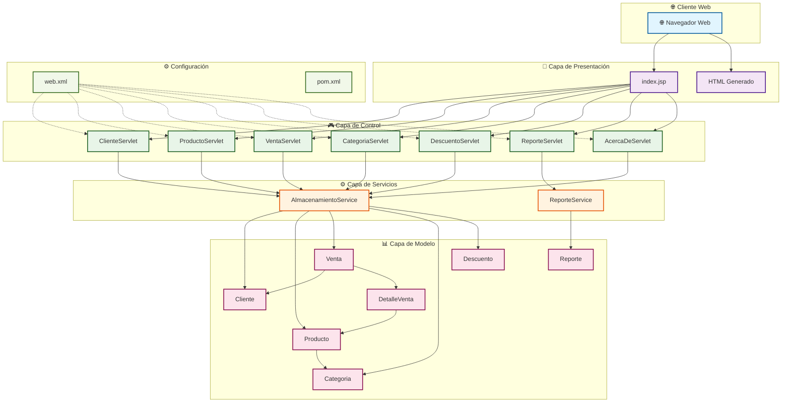
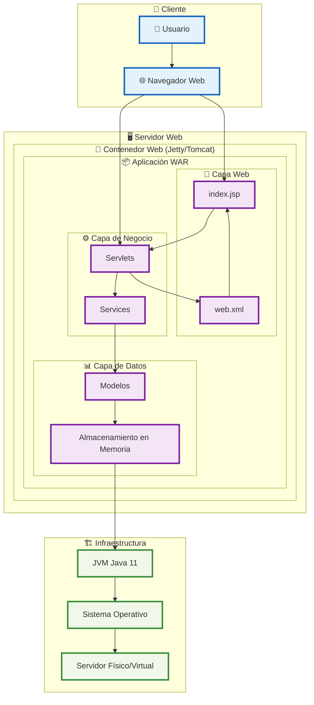
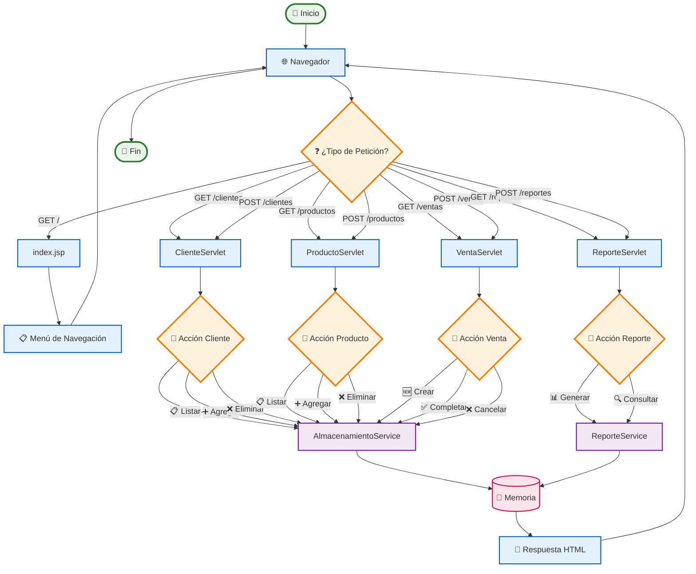
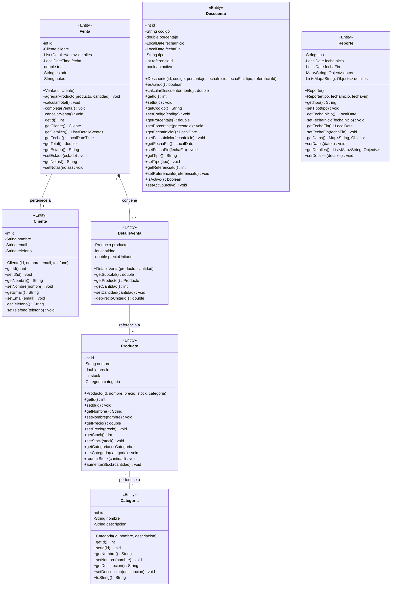
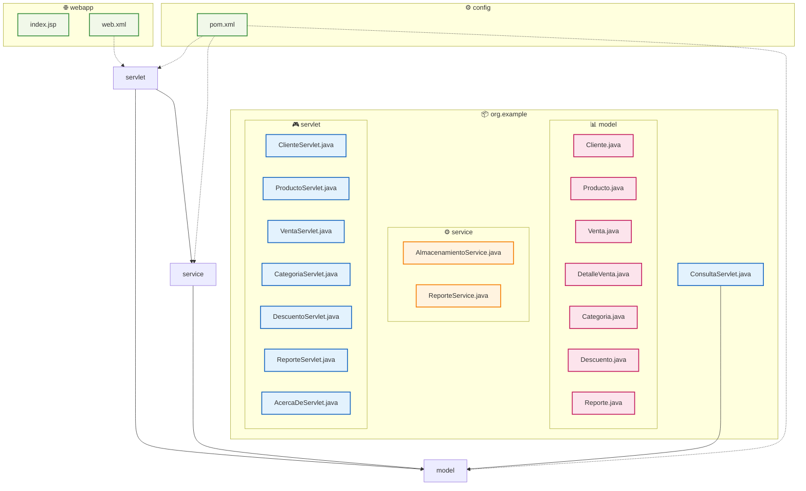
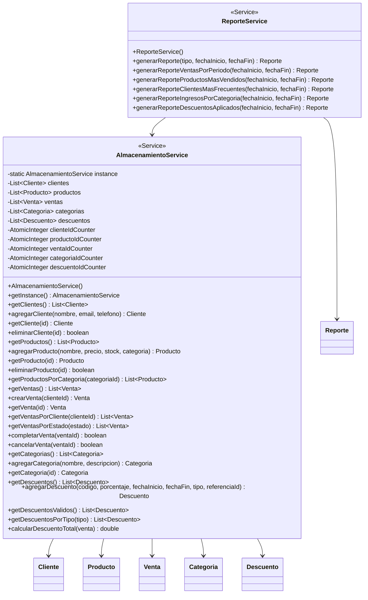
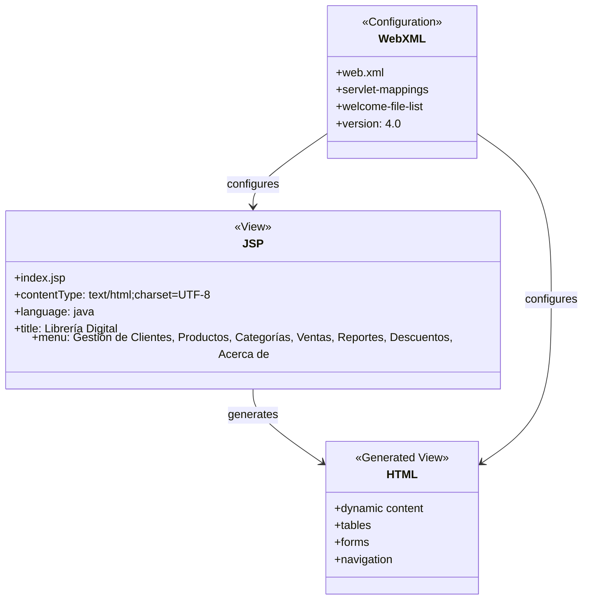

# Estructura del Proyecto Librería Digital

## 📁 Estructura Completa de Carpetas y Archivos

```
LibreriaDigital/
├── 📄 pom.xml                                    # Configuración principal de Maven - define dependencias y plugins
├── 📄 README.md                                  # Documentación del proyecto - instrucciones de instalación y uso
├── 📄 architecture.md                            # Análisis arquitectónico detallado de la aplicación
├── 📄 diagrams.md                                # Este archivo - estructura de carpetas y archivos
│
├── 📁 src/                                       # Código fuente principal
│   └── 📁 main/                                  # Código fuente de la aplicación
│       ├── 📁 java/                              # Código Java
│       │   └── 📁 org/                           # Paquete organizacional
│       │       └── 📁 example/                   # Paquete de ejemplo
│       │           ├── 📄 ConsultaServlet.java   # Servlet de prueba - muestra "Hola Mundo"
│       │           │
│       │           ├── 📁 model/                 # Capa de Modelo - Entidades de dominio
│       │           │   ├── 📄 Categoria.java     # Entidad Categoria - representa categorías de productos
│       │           │   ├── 📄 Cliente.java       # Entidad Cliente - datos de clientes del sistema
│       │           │   ├── 📄 Descuento.java     # Entidad Descuento - cupones y promociones
│       │           │   ├── 📄 DetalleVenta.java  # Entidad DetalleVenta - líneas de venta individuales
│       │           │   ├── 📄 Producto.java      # Entidad Producto - libros y productos de la librería
│       │           │   ├── 📄 Reporte.java       # Entidad Reporte - estructura de datos para reportes
│       │           │   └── 📄 Venta.java         # Entidad Venta - transacciones de venta completas
│       │           │
│       │           ├── 📁 service/               # Capa de Servicios - Lógica de negocio
│       │           │   ├── 📄 AlmacenamientoService.java  # Servicio principal - gestión de datos en memoria
│       │           │   └── 📄 ReporteService.java         # Servicio de reportes - generación de estadísticas
│       │           │
│       │           └── 📁 servlet/               # Capa de Controladores - Servlets (MVC Controller)
│       │               ├── 📄 AcercaDeServlet.java        # Servlet informativo - página "Acerca de"
│       │               ├── 📄 CategoriaServlet.java       # Controlador de categorías - CRUD categorías
│       │               ├── 📄 ClienteServlet.java         # Controlador de clientes - CRUD clientes
│       │               ├── 📄 DescuentoServlet.java       # Controlador de descuentos - gestión de promociones
│       │               ├── 📄 ProductoServlet.java        # Controlador de productos - CRUD productos
│       │               ├── 📄 ReporteServlet.java         # Controlador de reportes - generación de informes
│       │               └── 📄 VentaServlet.java           # Controlador de ventas - gestión de transacciones
│       │
│       └── 📁 webapp/                            # Recursos web - vistas y configuración
│           ├── 📄 index.jsp                      # Página principal - menú de navegación
│           └── 📁 WEB-INF/                       # Configuración de la aplicación web
│               └── 📄 web.xml                    # Descriptor de despliegue - mapeo de servlets
│
└── 📁 target/                                    # Archivos compilados (generado por Maven)
    └── (archivos generados automáticamente)
```

## 🏗️ Arquitectura por Capas

### **Capa de Presentación (View)**
- **Ubicación**: `src/main/webapp/`
- **Tecnología**: JSP, HTML, CSS
- **Archivos**:
  - `index.jsp` - Interfaz principal con menú de navegación
  - HTML generado dinámicamente desde los Servlets

### **Capa de Control (Controller)**
- **Ubicación**: `src/main/java/org/example/servlet/`
- **Tecnología**: Jakarta EE Servlets
- **Archivos**:
  - `ClienteServlet.java` - Gestión CRUD de clientes
  - `ProductoServlet.java` - Gestión CRUD de productos
  - `VentaServlet.java` - Gestión de transacciones de venta
  - `CategoriaServlet.java` - Gestión CRUD de categorías
  - `DescuentoServlet.java` - Gestión de descuentos y promociones
  - `ReporteServlet.java` - Generación de reportes y estadísticas
  - `AcercaDeServlet.java` - Página informativa del sistema

### **Capa de Servicios (Service)**
- **Ubicación**: `src/main/java/org/example/service/`
- **Tecnología**: Java POJOs
- **Archivos**:
  - `AlmacenamientoService.java` - Servicio principal con patrón Singleton para gestión de datos en memoria
  - `ReporteService.java` - Servicio especializado para generación de reportes

### **Capa de Modelo (Model)**
- **Ubicación**: `src/main/java/org/example/model/`
- **Tecnología**: Java POJOs (Entidades de dominio)
- **Archivos**:
  - `Cliente.java` - Entidad que representa un cliente del sistema
  - `Producto.java` - Entidad que representa un producto/libro
  - `Venta.java` - Entidad que representa una transacción de venta
  - `DetalleVenta.java` - Entidad que representa una línea de venta
  - `Categoria.java` - Entidad que representa una categoría de productos
  - `Descuento.java` - Entidad que representa un descuento o promoción
  - `Reporte.java` - Entidad que estructura los datos de reportes

## 📋 Detalles de Archivos por Categoría

### **Archivos de Configuración**
- `pom.xml` - Configuración Maven con dependencias Jakarta EE, plugins de compilación y despliegue
- `web.xml` - Configuración de la aplicación web con mapeo de servlets y configuración de sesiones

### **Archivos de Documentación**
- `README.md` - Documentación del proyecto con instrucciones de instalación y uso
- `architecture.md` - Análisis arquitectónico detallado de la aplicación
- `diagrams.md` - Este archivo con estructura de carpetas

### **Archivos de Prueba**
- `ConsultaServlet.java` - Servlet de prueba ubicado en el paquete raíz

## 🔄 Flujo de Datos

```
Cliente Web → Servlet (Controller) → Service (Business Logic) → Model (Data)
                ↓
            JSP/HTML (View) ← Response
```

## 📊 Estadísticas del Proyecto

- **Total de archivos Java**: 15
- **Total de archivos JSP**: 1
- **Total de archivos XML**: 2
- **Total de archivos Markdown**: 3
- **Total de carpetas**: 10
- **Capa de Controladores**: 7 servlets
- **Capa de Servicios**: 2 servicios
- **Capa de Modelo**: 7 entidades

## 🎯 Patrones Arquitectónicos Identificados

1. **MVC (Model-View-Controller)**
   - Model: Entidades en `model/`
   - View: JSP y HTML generado
   - Controller: Servlets en `servlet/`

2. **Singleton Pattern**
   - `AlmacenamientoService` implementa patrón Singleton

3. **Service Layer Pattern**
   - Servicios en `service/` encapsulan lógica de negocio

4. **Front Controller Pattern**
   - Cada Servlet actúa como front controller para su dominio

5. **Data Transfer Object (DTO)**
   - Las entidades actúan como DTOs para transferir datos

## 🚀 Endpoints Disponibles

- `/` - Página principal (index.jsp)
- `/clientes` - Gestión de clientes
- `/productos` - Gestión de productos
- `/ventas` - Gestión de ventas
- `/categorias` - Gestión de categorías
- `/descuentos` - Gestión de descuentos
- `/reportes` - Generación de reportes
- `/acerca-de` - Información del sistema

---

# 📊 Diagramas Arquitectónicos

## 1. Diagrama de Componentes



## 2. Diagrama de Despliegue



## 3. Diagrama de Flujo de Datos



## 4. Diagrama de Clases Principal



## 5. Diagrama de Paquetes



## 6. Diagramas de Clases por Carpeta

### 6.1 Diagrama de Clases - Carpeta `model`


### 6.2 Diagrama de Clases - Carpeta `service`



### 6.3 Diagrama de Clases - Carpeta `servlet`

```mermaid
classDiagram
    class HttpServlet {
        <<abstract>>
        +doGet(request, response) void
        +doPost(request, response) void
    }
    
    class ClienteServlet {
        <<Controller>>
        -AlmacenamientoService almacenamiento
        +ClienteServlet()
        +doGet(request, response) void
        +doPost(request, response) void
        -mostrarClientes(response, clientes) void
        -mostrarCliente(response, cliente) void
    }
    
    class ProductoServlet {
        <<Controller>>
        -AlmacenamientoService almacenamiento
        +ProductoServlet()
        +doGet(request, response) void
        +doPost(request, response) void
        -mostrarProductos(response, productos) void
        -mostrarProducto(response, producto) void
    }
    
    class VentaServlet {
        <<Controller>>
        -AlmacenamientoService almacenamiento
        +VentaServlet()
        +doGet(request, response) void
        +doPost(request, response) void
        -mostrarVentas(response, ventas) void
        -mostrarVenta(response, venta) void
        -mostrarFormularioVenta(response) void
    }
    
    class CategoriaServlet {
        <<Controller>>
        -AlmacenamientoService almacenamiento
        +CategoriaServlet()
        +doGet(request, response) void
        +doPost(request, response) void
        -mostrarCategorias(response, categorias) void
        -mostrarCategoria(response, categoria) void
    }
    
    class DescuentoServlet {
        <<Controller>>
        -AlmacenamientoService almacenamiento
        +DescuentoServlet()
        +doGet(request, response) void
        +doPost(request, response) void
        -mostrarDescuentos(response, descuentos) void
        -mostrarDescuento(response, descuento) void
    }
    
    class ReporteServlet {
        <<Controller>>
        -ReporteService reporteService
        -DateTimeFormatter formatter
        +ReporteServlet()
        +doGet(request, response) void
        -mostrarFormularioReportes(response) void
        -mostrarReporte(reporte, response) void
        -obtenerTituloReporte(tipo) String
        -obtenerColumnasReporte(tipo) String[]
    }
    
    class AcercaDeServlet {
        <<Controller>>
        +AcercaDeServlet()
        +doGet(request, response) void
    }
    
    HttpServlet <|-- ClienteServlet
    HttpServlet <|-- ProductoServlet
    HttpServlet <|-- VentaServlet
    HttpServlet <|-- CategoriaServlet
    HttpServlet <|-- DescuentoServlet
    HttpServlet <|-- ReporteServlet
    HttpServlet <|-- AcercaDeServlet
    
    ClienteServlet --> AlmacenamientoService
    ProductoServlet --> AlmacenamientoService
    VentaServlet --> AlmacenamientoService
    CategoriaServlet --> AlmacenamientoService
    DescuentoServlet --> AlmacenamientoService
    ReporteServlet --> ReporteService
```



### 6.4 Diagrama de Clases - Carpeta `webapp`

